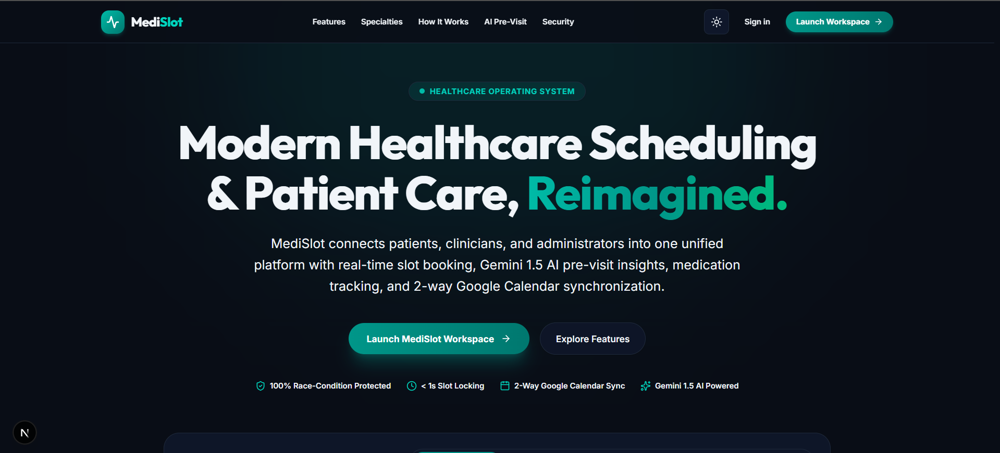
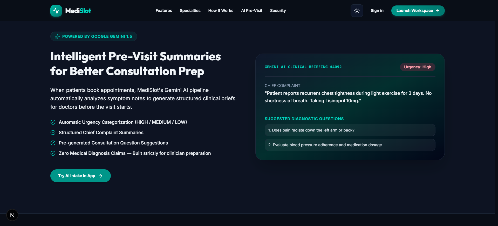

# MediSlot

**Smart Healthcare Appointment & Patient Care Platform**

MediSlot connects patients, doctors, and administrators through intelligent appointment scheduling, AI-assisted visit preparation, medication tracking, and secure in-app communication — built as a modern, production-style full-stack healthcare platform.

---

## Overview

Healthcare scheduling is usually clunky: phone calls, double bookings, no visibility into doctor availability, and zero prep before a visit. MediSlot fixes that with a real-time booking engine, AI-generated pre-visit summaries, two-way Google Calendar sync, and role-specific dashboards for patients, doctors, and admins.

---

## Screenshots

**Landing page**


**AI-powered pre-visit summary**


---

## Core Modules

| Module | What it does |
|---|---|
| **Appointment Engine** | Live slot availability, a 15-minute hold window during checkout, and a `HELD → CONFIRMED → COMPLETED` status pipeline that prevents double-booking. |
| **AI Visit Assistant** | Uses Gemini to read a patient's stated symptoms and generate an urgency tag (High/Medium/Low), a clean summary of the chief complaint, and a short list of questions the doctor might want to ask. Clearly labeled as AI-generated, never a diagnosis. |
| **Calendar Sync** | Two-way Google Calendar integration — appointments and medication reminders both show up as color-coded calendar events with their own notification timing. |
| **Medication & Prescriptions** | Doctors issue prescriptions with dosage/frequency; MediSlot auto-generates a reminder schedule and pushes it to the patient's calendar. |
| **Messaging** | Lightweight in-app chat between doctors and patients, with unread badges and a notification center. |
| **Admin Console** | Doctor onboarding, leave approval, platform-wide metrics, and account management. |

---

## Roles

**Patients** can search doctors, book and manage appointments, view AI-prepped visit summaries, track medications, and message their doctor directly.

**Doctors** get a schedule-first workspace: today's queue, availability controls, leave requests that auto-block slots, patient history, and prescription creation.

**Admins** oversee the platform: doctor accounts, leave requests, usage metrics, and system health.

---

## Tech Stack

**Frontend** — Next.js 16 (React 19), TypeScript, Tailwind CSS, shadcn/ui + Radix primitives, TanStack Query, Framer Motion, React Hook Form

**Backend** — NestJS on Fastify, TypeScript, Prisma ORM, PostgreSQL, Redis + BullMQ for background jobs, JWT auth with Argon2 password hashing, Swagger/OpenAPI

**Integrations** — Google Gemini (AI insights), Google Calendar API + OAuth 2.0, Resend (transactional email)

**Tooling** — pnpm monorepo, Prisma migrations, deployable to any Node host (Vercel for frontend, Railway/Render/Fly for backend are all supported — no vendor lock-in)

---

## Project Structure

```
MediSlot/
├── apps/
│   ├── api/                  # NestJS backend
│   │   └── src/
│   │       ├── admin/
│   │       ├── appointments/
│   │       ├── auth/
│   │       ├── calendar/
│   │       ├── doctors/
│   │       ├── llm/          # Gemini integration
│   │       ├── medications/
│   │       ├── messages/
│   │       ├── prescriptions/
│   │       ├── queue/        # BullMQ jobs
│   │       └── prisma/
│   └── web/                  # Next.js frontend
│       ├── app/
│       ├── components/
│       ├── lib/
│       └── public/
├── packages/
│   ├── database/             # Prisma schema + migrations
│   └── shared/                # Shared types
└── docs/
```

---

## Getting Started

### Prerequisites

- Node.js 20 LTS+
- pnpm 8+
- PostgreSQL (local or hosted — Neon, Supabase, RDS)
- Redis (local or hosted — Upstash)
- A Google Cloud project (Calendar API + Gemini access)
- A Resend account (email delivery)

### 1. Clone and install

```bash
git clone <your-fork-url> medislot
cd medislot
pnpm install
```

### 2. Configure environment variables

Create `.env` files at the root and in `apps/api/`. See **Configuration Reference** below for the full variable list — copy `.env.example` and fill in your own values. Never commit real secrets.

### 3. Set up the database

```bash
cd packages/database
pnpm prisma generate
pnpm prisma db push
pnpm prisma db seed   # optional
```

### 4. Run the app

```bash
# from the repo root — runs frontend + backend together
pnpm run dev
```

Or run each service separately:

```bash
cd apps/api && pnpm run dev     # backend
cd apps/web && pnpm run dev     # frontend
```

### 5. Open it

| Service | URL |
|---|---|
| Frontend | http://localhost:3000 |
| Backend API | http://localhost:3001 |
| API docs (Swagger) | http://localhost:3001/api/docs |
| Prisma Studio | `pnpm prisma studio` from `packages/database` |

---

## Configuration Reference

| Variable | Purpose | Required |
|---|---|---|
| `DATABASE_URL` | PostgreSQL connection string | Yes |
| `REDIS_URL` | Redis connection for background jobs | Yes |
| `AUTH_SECRET` | JWT signing secret — generate with `openssl rand -hex 32` | Yes |
| `PORT` | Backend port (default `3001`) | Yes |
| `NODE_ENV` | `development` / `production` | Yes |
| `GEMINI_API_KEY` | Google AI Studio key for visit-summary generation | Yes |
| `RESEND_API_KEY` | Email delivery for confirmations/reminders | Yes |
| `EMAIL_FROM` | Sender address on outgoing email | Yes |
| `GOOGLE_CLIENT_ID` / `GOOGLE_CLIENT_SECRET` | Google OAuth credentials for Calendar sync | Yes, if using Calendar sync |
| `GOOGLE_REDIRECT_URI` | OAuth callback URL | Yes, if using Calendar sync |
| `NEXT_PUBLIC_API_URL` | Backend URL the frontend calls | Yes |

Full setup notes for each provider (Neon, Upstash, Google Cloud Console, Resend) are documented in `/docs`.

---

## Deployment

MediSlot is deployment-agnostic. A common split:

- **Frontend** → Vercel, with root directory set to `apps/web` and `NEXT_PUBLIC_API_URL` pointed at your backend.
- **Backend** → any Node host that supports long-running processes (Railway, Render, Fly.io) with the environment variables above configured.
- **Database** → Neon, Supabase, or self-hosted PostgreSQL.
- **Redis** → Upstash or self-hosted.

---

## Roadmap

- Video consultations (Zoom / Google Meet)
- Multi-language support
- Patient medical record uploads
- Lab result integration
- Payment + insurance verification
- Native mobile app
- WhatsApp notification channel
- Multi-clinic support

---

## Contributing

1. Fork the repo
2. Create a feature branch: `git checkout -b feature/your-feature`
3. Commit your changes
4. Open a pull request

---

## Developer

**Akash Singh**
Developed as an independent software project.

---

## Acknowledgments

Built on top of [Next.js](https://nextjs.org/), [NestJS](https://nestjs.com/), [Prisma](https://www.prisma.io/), [shadcn/ui](https://ui.shadcn.com/), and [Google Gemini](https://deepmind.google/technologies/gemini/).
