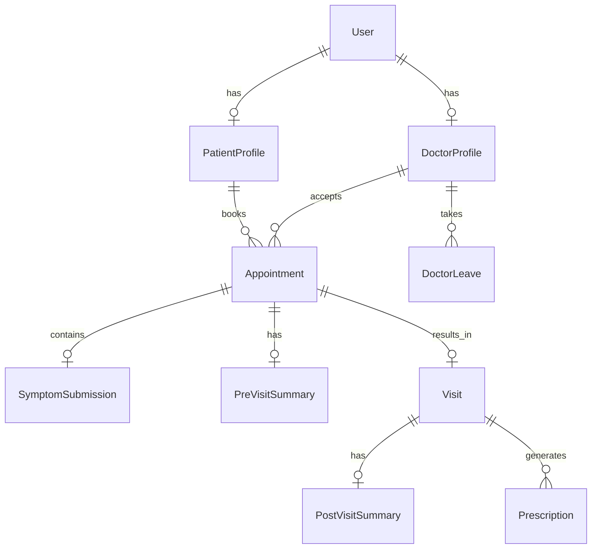

# Database Architecture

## ER Diagram (Conceptual)

## Key Tables & Constraints

### Appointment
The central table of the application.
- `doctorId`
- `patientId`
- `startTime`
- `endTime`
- `status` (HELD, CONFIRMED, CANCELLED, RESCHEDULE_REQUIRED)
- **Constraints:** `@@unique([doctorId, startTime])` is critical. It guarantees at the database level that no two appointments can overlap on the exact same starting slot for the same doctor.

### OutboxEvent
Handles reliable messaging.
- `payload`
- `type`
- `status` (PENDING, PROCESSING, COMPLETED, FAILED)
- **Indexes:** Indexed on `[status, createdAt]` to allow rapid polling of unprocessed events by the worker queue.

### DoctorLeave
Handles doctor availability overrides.
- `doctorId`
- `date`
- **Constraints:** `@@unique([doctorId, date])` to prevent duplicate leave entries for the same day.
